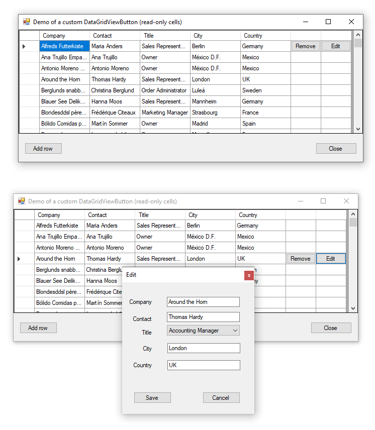

# TechNet Wiki article
[Windows DataGridView with inline edit and remove buttons](https://social.technet.microsoft.com/wiki/contents/articles/51226.windows-datagridview-with-inline-edit-and-remove-buttons.aspx)

There are several methods to permit editing and removal of records displayed in a Windows DataGridView from inline editing of cells to display a modal window invoked by either a button or by double-clicking the current DataGridView row/cells or a combination of both. An alternate approach is to provide buttons within the DataGridView, one for edit and one for removal of a row. This article will explain how to implement editing and deleting the current row in a DataGridView utilizing a custom DataGridView button column which is set up for displaying the buttons on the current row only rather than displaying the buttons on all rows at once.

### Asynchronous data reads
Although there is no actual need for reading database tables using asynchronous programming model TAP this code sample does which had been done off-hand to show performing reads without explicitly defining a task but instead utilizing async methods available in the .NET Framework.

### Update 10/2021

Added stub code for button conext menu

Remove button does not have a menu while the Edit button has a menu with two items, click events with no actions.

